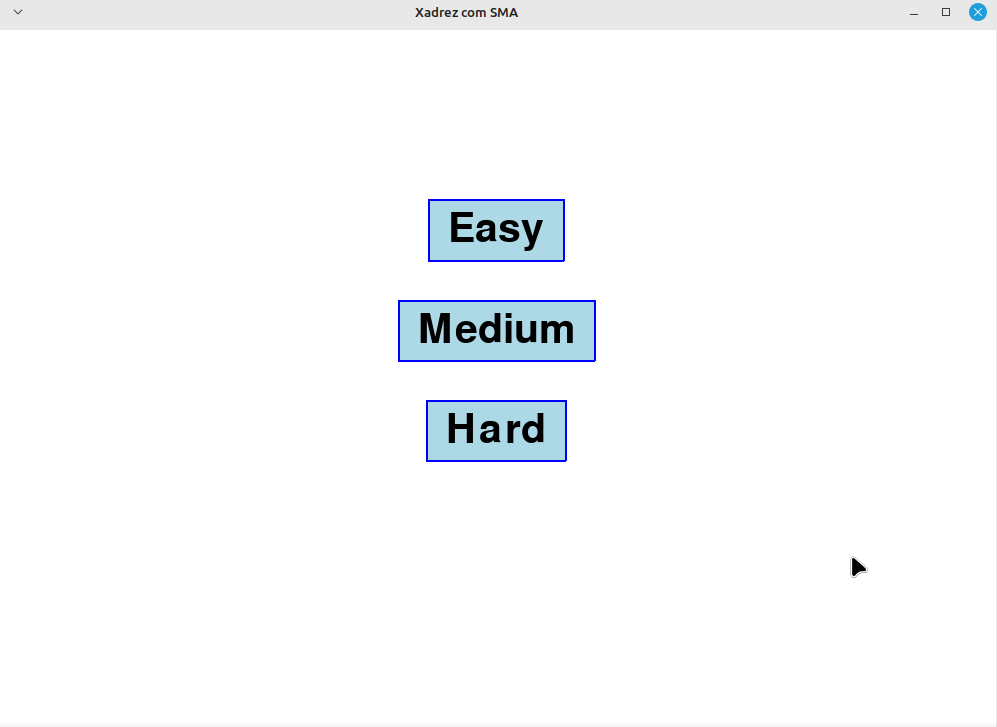
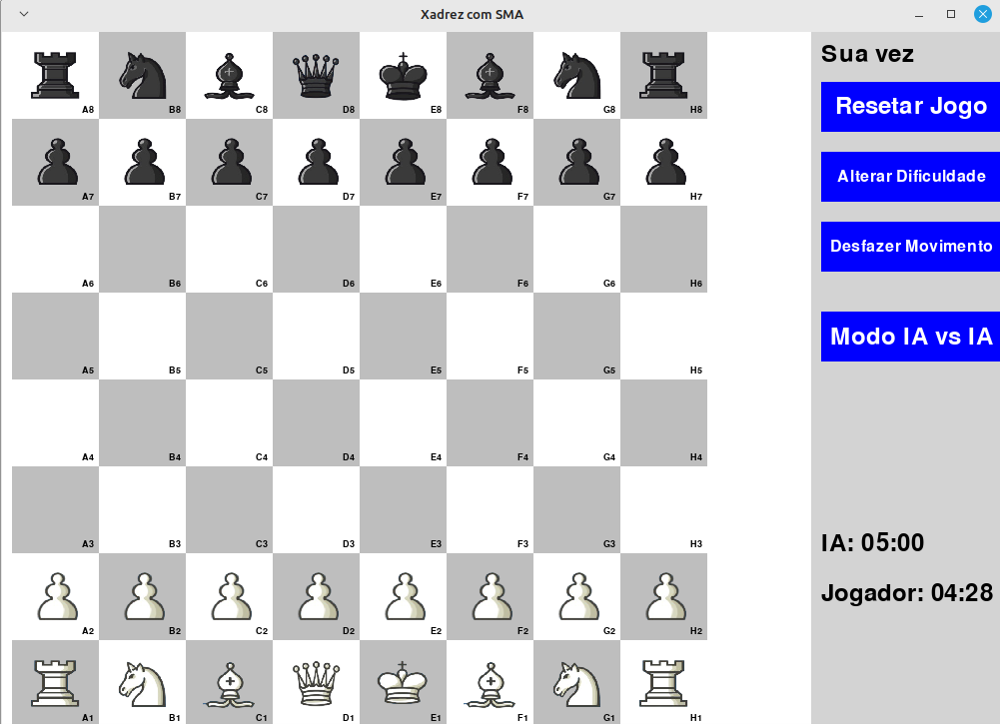

# G4 - Xadrez usando multi agentes

**Disciplina**: FGA0210 - PARADIGMAS DE PROGRAMAÇÃO - T01 <br>
**Nro do Grupo (de acordo com a Planilha de Divisão dos Grupos)**: 04<br>
**Paradigma**: Sistema Multi-Agentes(SMA)<br>

## Alunos
|Matrícula | Aluno |
| -- | -- |
| 20/0060783  |  Ana Beatriz Wanderley Massuh |
| 20/0057421  |  Delziron Braz de Lima |
| 20/0018060  |  Gabriel Ferreira da Silva |
| 20/0030264  |  Guilherme Nishimura da Silva |
| 18/0121847  |  Helder Lourenço de Abreu Marques |
| 18/0136925  |  Hugo Rocha de Moura |
| 19/0142260  |  Mateus de Almeida Dias |
| 20/0025791  |  Pablo Guilherme de Jesus Batista Silva |

## Sobre 

O projeto visa simular um jogo de xadrez em que o jogador pode jogar contra diversos agentes, bem como um jogo de IA vs IA, usando o Mesa e Stockfish como apoio.

## Screenshots
Figura 1 - Modo de Escolha de Dificuldade

Figura 2 - Tabuleiro de Xadrez


Figura 3 - Funcionamento do Jogo de Tabuleiro

Tabuleiro de Xadrez
## Instalação 
**Linguagens**: Python<br>
**Tecnologias**: Mesa<br>

Requisitos para execução sendo:
- [Python](https://www.python.org/downloads/): versão 3.10 ou maior<br>
pacote de instalador basico do python [PIP](https://pip.pypa.io/en/stable/getting-started/), 22.0.2 ou maior

[Link do Documento de Instalação do PIP Python para OS](https://pip.pypa.io/en/stable/installation/)

### Videos para instalação do PIP python

#### Linux
[Video Tutorial Linux](https://www.youtube.com/watch?v=8AKT73QODZM)

#### MAC
[Video Tutorial MAC](https://www.youtube.com/watch?v=MuOy6I7ng_Q)

#### Windows
[Video Tutorial Windows](https://www.youtube.com/watch?v=kJaOGOA-MhY)


As versões para outros pacotes ou bibliotecas requeridas, estão no requirements.txt, e serão instaladas a seguir no tutorial.

#### 1- Atualize o cache do pacote
```sudo apt update```

#### 2- instale os requisitos
```pip install -r requirements.txt```

## Uso 
Como usar o projeto.

Para executar o projeto 
``` python3 chess_game.py```

Após isso devera abrir uma janela de pop up para prosseguimento de definição de dificuldade e modo de jogo sendo IA vs IA ou IA vs player.

## Vídeo
Adicione 1 ou mais vídeos com a execução do projeto.
Procure: 
(i) Introduzir o projeto;
(ii) Mostrar passo a passo o código, explicando-o, e deixando claro o que é de terceiros, e o que é contribuição real da equipe;
(iii) Apresentar particularidades do Paradigma, da Linguagem, e das Tecnologias, e
(iV) Apresentar lições aprendidas, contribuições, pendências, e ideias para trabalhos futuros.
OBS: TODOS DEVEM PARTICIPAR, CONFERINDO PONTOS DE VISTA.
TEMPO: +/- 15min

## Participações
|Nome do Membro | Contribuição | Significância da Contribuição para o Projeto (Excelente/Boa/Regular/Ruim/Nula) |
| -- | -- | -- |
| Ana Beatriz | Implementação um comportamento aleatório para as peças controladas por agentes no tabuleiro, além de adicionar um contador de tempo. | Excelente |
| Delziron Braz | base De IA otimizações e refatorações |   Excelente |
| Gabriel Ferreira da Silva | Pesquisa sobre controle, Multi-agentes e game design de tabuleiro|   Excelente |
| Guilherme Nishimura  |Pesquisa de projeto , documentação e refatoração no game criação do tabuleiro base com a base de ia  | Execelente |
| Helder Lourenço | Criação da documentação, atualização dos multi agentes | Excelente |
| Hugo  |  Pesquisa de projetos, criação do tabuleiro base | Excelente | Excelente |
| Pablo  |  Funções de menu e de janelas, bem como logica Multi-Agentes | Excelente |

## Outros 

#### Lições Aprendidas e Percepções

- As lições aprendindas foram a possibilidade de uso de classes em e aprendizado em Pthon que alguns membros do grupo pouco tinham, uso de SMA(Sistema Multi-Agentes) em Python, descoberta de bibliotecas novas para Xadrez, revisão de algoritmos e aprendizado de novos, uso dinâmico dos agentes para udar comportamentos a cada jogada.
- Apesar de sofrer com problemas relacionados a interação entre agentes, com scheduler colocando todas as peças para se moverem ao mesmo tempo, falta de algumas ações na interface e alguns pontos para análise estátisca, apesar do mesmo possuir simulação, foi possivel concluir o projeto e até o momento a maioria dos membros puderam contribuir com o trabalho.

#### Contribuições e Fragilidades
 outro ponto após esse desenvolvimento, foi a possibilidade de verifica um pouco do quão bom MESA e os SMA's são,
Utilizando o Python, o grupo todo pode instalar o projeto, sem problemas iniciais de instalação. Entretanto escolher o tipo de projeto(JADE ou MESA) e o curto período de desenvolvimento foi um ponto desafiador para o grupo. Então Apesar de alguns erros e problemas com conceitos de implementação de Multi-Agente para o MESA, o trbalho pode prosseguir com boa desenvolvotura e o que pode ser chamado de MVP(Mínimo Produto Viável) pode ser feito coma contribuição de todos. 

#### Trabalhos Futuros

Para trabalhos futuros o que pode ser incrementado e/ou corrigido são:

- Adicionar para ele realizar múltiplos jogos com  a 5 agentes diferentes, dividindo a tela
- Adicionar um multiplayer, no qual ao final da partida ele demonstrar quais eram a melhores jogadas
- Plano de Fundo editável
- Adicionar para ele realizar múltiplos jogos com  a 5 agentes diferentes, dividindo a tela
- Adicionar um smoth para movimentação da peça
- Multiplayer entre computadores diferentes
- Torneio, modo local com agentes e players
- Um agente para tirar dúvidas básicas, como peças e regras [Tenho dúvida, se realmente não dá]
- Opção de escolhas se você jogar com as peças brancas ou pretas
- Adicionar a interface gráfica o modo de vitória
- Adicionar um modo para gerar um PDF com as partidas realizadas e porcentagem de erros e acertos
- Consertar temporizador para IA
- Adicionar display para controlar as IA's de acordo com a vontade do jogador

## Fontes
Referencie, adequadamente, as referências utilizadas.

### REFERÊNCIAS

- STOCKFISH developers. Stockfish: Software. Disponível em: https://stockfishchess.org/. Acesso em: 04 ago. 2024.

- KAZIL, Jackie; MASAD, David; CROOKS, Andrew. Utilizing Python for Agent-Based Modeling: The Mesa Framework. In: THOMSON, Robert; BISGIN, Halil; DANCY, Christopher; HYDER, Ayaz; HUSSAIN, Muhammad (orgs.). Social, Cultural, and Behavioral Modeling. Cham: Springer International Publishing, 2020. p. 308-317.

- DUQUE, Rafael. Um guia passo a passo para criar uma IA de xadrez simples. FreeCodeCamp, 9 ago. 2023. Disponível em: https://www.freecodecamp.org/portuguese/news/um-guia-passo-a-passo-para-criar-uma-ia-de-xadrez-simples/. Acesso em: 30 jul. 2024.

